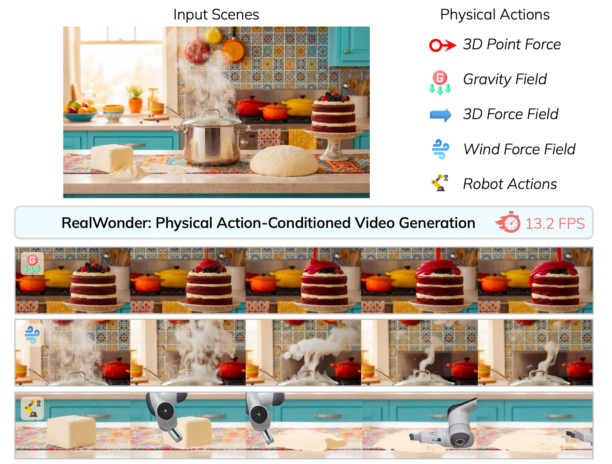

# RealWonder: Real-Time Physical Action-Conditioned Video Generation

**[Project Page](https://liuwei283.github.io/RealWonder/) | [arXiv](https://arxiv.org/abs/XXXX.XXXXX)**

---

[Wei Liu](https://liuwei283.github.io/)<sup>1\*</sup> &nbsp;
[Ziyu Chen](https://ziyc.github.io/)<sup>1\*</sup> &nbsp;
[Zizhang Li](https://kyleleey.github.io/)<sup>1</sup> &nbsp;
[Yue Wang](https://yuewang.xyz/)<sup>2</sup> &nbsp;
[Hong-Xing (Koven) Yu](https://kovenyu.com/)<sup>1†</sup> &nbsp;
[Jiajun Wu](https://jiajunwu.com/)<sup>1†</sup>

<sup>1</sup>Stanford University &nbsp; <sup>2</sup>University of Southern California &nbsp; <sup>\*</sup>Equal contribution &nbsp; <sup>†</sup>Equal advising

---

## Abstract

Current video generation models cannot simulate physical consequences of 3D actions like forces and robotic manipulations, as they lack structural understanding of how actions affect 3D scenes. We present RealWonder, the first real-time system for action-conditioned video generation from a single image. Our key insight is using physics simulation as an intermediate bridge: instead of directly encoding continuous actions, we translate them through physics simulation into visual representations (optical flow and RGB) that video models can process. RealWonder integrates three components: 3D reconstruction from single images, physics simulation, and a distilled video generator requiring only 4 diffusion steps. Our system achieves 13.2 FPS at 480×832 resolution, enabling interactive exploration of forces, robot actions, and camera controls on rigid objects, deformable bodies, fluids, and granular materials.



---

## Installation

### 1. Create Environment

```bash
conda env create -f default.yml
conda activate realwonder
```

### 2. Install SAM 3D Objects

```bash
cd submodules/sam_3d_objects
export PIP_EXTRA_INDEX_URL="https://pypi.ngc.nvidia.com https://download.pytorch.org/whl/cu121"
pip install -e '.[dev]'
pip install -e '.[p3d]'
export PIP_FIND_LINKS="https://nvidia-kaolin.s3.us-east-2.amazonaws.com/torch-2.5.1_cu121.html"
pip install -e '.[inference]'
./patching/hydra
cd ../..
```

#### Checkpoints

```bash
pip install 'huggingface-hub[cli]<1.0'
TAG=hf
hf download --repo-type model --local-dir checkpoints/${TAG}-download --max-workers 1 facebook/sam-3d-objects
mv checkpoints/${TAG}-download/checkpoints checkpoints/${TAG}
rm -rf checkpoints/${TAG}-download
```

### 3. Install SAM 2

```bash
cd submodules/sam2
pip install -e .
cd checkpoints && ./download_ckpts.sh && cd ..
cd ../..
```

### 4. Install Genesis

```bash
cd submodules/Genesis
git checkout 3aa206cd84729bc7cc14fb4007aeb95a0bead7aa
pip install -e .
cd ../..
```

### 5. Install Other Dependencies

```bash
pip install -r requirements.txt
```

### 6. Download Model Checkpoints

```bash
hf download ziyc/realwonder --include "Realwonder-Distilled-AR-I2V-Flow/*" --local-dir ckpts/
hf download alibaba-pai/Wan2.1-Fun-V1.1-1.3B-InP --local-dir wan_models/Wan2.1-Fun-V1.1-1.3B-InP
```

---

## Usage

### Interactive Demo (Real-Time UI)

Tested on NVIDIA H200 GPU with CUDA 12.1.

#### Installation

```bash
pip install -r demo_web/requirements.txt
```

#### How to run

```bash
cd demo_web
python app.py \
    --demo_data demo_data/lamp \
    --checkpoint_path /path/to/checkpoint.pt
```

<table align="center"><tr>
  <td><video src="https://github.com/user-attachments/assets/97fa7a0f-9122-40c7-a13f-92d72de82542" controls></video></td>
  <td><video src="https://github.com/user-attachments/assets/e9dadbad-7e76-4e82-94d1-eaf1d0c48c38" controls></video></td>
</tr></table>


### Offline Inference

Run physics simulation:

```bash
python case_simulation.py --config_path demo_data/lamp/config.yaml
```

Run video generation from simulation results:

```bash
python infer_sim.py \
    --checkpoint_path ckpts/Realwonder-Distilled-AR-I2V-Flow/sink_size=1-attn_size=21-frame_per_block=3-denoising_steps=4/step=000800.pt \
    --sim_data_path result/lamp/final_sim \
    --output_path result/lamp/final_sim/final.mp4
```

---

## Citation

```bibtex
@misc{realwonder2026,
  title={RealWonder: Real-Time Physical Action-Conditioned Video Generation},
  author={Liu, Wei and Chen, Ziyu and Li, Zizhang and Wang, Yue and Yu, Hong-Xing and Wu, Jiajun},
  year={2026},
  eprint={XXXX.XXXXX},
  archivePrefix={arXiv},
  primaryClass={cs.CV},
  url={https://arxiv.org/abs/XXXX.XXXXX},
}
```
