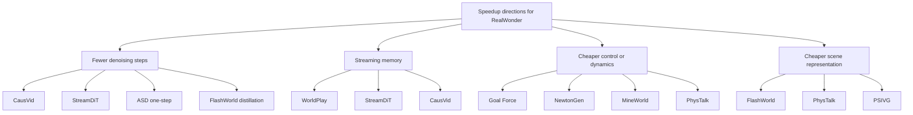

# Interactive Video Speedup Survey For RealWonder

Date: 2026-03-30

## 1. Goal

This note reads the user-provided papers, adds a small set of recent high-level papers with strong relevance to fast or interactive video generation, and evaluates them against the current RealWonder codebase.

The target question is not:

"Which paper is most interesting?"

The target question is:

"Which ideas can most plausibly make RealWonder faster while keeping its physics-conditioned interaction advantage?"

## 2. RealWonder Baseline To Keep In Mind

From the current repo, RealWonder already uses the following acceleration stack:

- precomputed reconstruction assets
- physics to visual bridge instead of direct action-to-video modeling
- block-causal generation
- 4-step distilled diffusion
- KV-cache reuse
- cached VAE encode/decode
- asynchronous pipeline overlap
- warmup to eliminate cold-start kernel latency

So the right papers for RealWonder are not generic "better video quality" papers. The best papers are the ones that help one of these four levers:

1. fewer denoising steps
2. better streaming memory at fixed latency
3. cheaper world/control representation
4. cheaper scene representation or rendering

## 3. Paper Map

### 3.1 Category view

### 3.2 Shortlist table

Legend:

- Speed gain: how directly the paper targets inference-time latency
- Fit: how naturally the idea can attach to current RealWonder code
- Code: public code found as of 2026-03-30

| Paper | Venue / status | Core idea | Speed gain for RealWonder | Fit | Code |
| --- | --- | --- | --- | --- | --- |
| [PhysRVG](https://arxiv.org/abs/2601.11087) | arXiv 2026 | physics-aware RL post-training | Low direct | Medium-Low | not obvious from arXiv page |
| [Goal Force](https://arxiv.org/abs/2601.05848) | CVPR 2026 | force-vector goal prompting without simulator at inference | Medium-High for some tasks | High | yes |
| [ProPhy](https://arxiv.org/abs/2512.05564) | arXiv 2025 | mixture-of-physics-experts for prompt alignment | Low direct | Medium | not obvious from arXiv page |
| [PSIVG](https://arxiv.org/abs/2603.06408) | CVPR 2026 | simulator-in-the-loop test-time guidance | Low for speed, high for physics fidelity | Medium | yes |
| [NewtonGen](https://arxiv.org/abs/2509.21309) | arXiv 2025 | learnable Newtonian dynamics latent | Medium | High | yes |
| [Video-As-Prompt](https://arxiv.org/abs/2510.20888) | arXiv 2025 | unified semantic control via video prompt | Low direct | Medium | yes |
| [FlashWorld](https://arxiv.org/abs/2510.13678) | ICLR 2026 Oral | 3D-oriented generation in seconds with distillation | Medium for total UX | Medium-High | yes, via HunyuanWorld release ecosystem |
| [WorldPlay](https://arxiv.org/abs/2512.14614) | arXiv 2025 / HY-World 1.5 | reconstituted long-horizon memory + distill | Very High | Very High | yes |
| [Sekai](https://arxiv.org/abs/2506.15675) | dataset paper | large exploration dataset | Indirect | Medium | project page |
| [PhysTalk](https://arxiv.org/abs/2512.24986) | arXiv 2025 | language-driven real-time physics on 3DGS scenes | Medium for simulator/render replacement | High | code not clearly public |
| [CausVid](https://arxiv.org/abs/2412.07772) | CVPR 2025 | bidirectional-to-causal 4-step streaming video diffusion | Very High | Very High | project page, code planned |
| [StreamDiT](https://arxiv.org/abs/2507.03745) | CVPR 2026 | moving buffer streaming diffusion + multi-process inference | Very High | High | public project page, public code not found |
| [ASD one-step](https://arxiv.org/abs/2511.01419) | ICLR 2026 Poster | adversarial self-distillation to 1-2 step causal video generation | Very High | Very High | code not found publicly |
| [MineWorld](https://arxiv.org/abs/2504.08388) | arXiv 2025 | autoregressive world model + diagonal decoding | High but architecture shift is large | Medium | yes |

## 4. Reading Notes For The User-Provided Papers

## 4.1 PhysRVG

Link: https://arxiv.org/abs/2601.11087

Main idea:

- physics-aware reinforcement learning for video generative models
- physical collision rules become direct feedback in optimization, not loose conditioning

Innovation:

- physics constraints are enforced in post-training via RL
- unified Mimicry-Discovery Cycle keeps physics-grounded feedback active during fine-tuning

Value for RealWonder:

- useful for improving physical plausibility of the final rendered video
- not a direct latency method
- likely a later-stage quality/post-training technique, not the first thing to do for speed

My verdict:

- valuable for physical realism
- low priority if the immediate target is FPS

## 4.2 Goal Force

Link: https://arxiv.org/abs/2601.05848

Main idea:

- use explicit force vectors and intermediate dynamics as the user goal representation
- no external physics simulator or 3D assets required at inference time

Innovation:

- force-vector prompting is much more specific than text-only goals
- trained on synthetic causal primitives and generalizes to tool use and multi-object causal chains

Why it matters for RealWonder:

- RealWonder currently pays the cost of Genesis in the loop
- Goal Force suggests a learned control path for a subset of tasks, especially rigid collisions and simple object interactions

Best use in RealWonder:

- not as a full replacement of Genesis
- as a "fast path" for simple rigid-object interactions where approximate dynamics are acceptable

My verdict:

- one of the most actionable papers in the provided list
- especially attractive for a hybrid system: learned control for simple cases, full physics for hard cases

## 4.3 ProPhy

Link: https://arxiv.org/abs/2512.05564

Main idea:

- explicit physics-aware conditioning via Mixture-of-Physics-Experts
- semantic experts plus refinement experts for local physical dynamics

Innovation:

- anisotropic response to physics prompts
- VLM physical reasoning transferred into generation refinement experts

Why it matters for RealWonder:

- could improve how text prompt and physical condition interact
- but it does not directly reduce simulation or diffusion cost

My verdict:

- moderate value for controllability and physics alignment
- low value for near-term speedup

## 4.4 PSIVG

Link: https://arxiv.org/abs/2603.06408

Main idea:

- use a physical simulator inside test-time video generation
- reconstruct a 4D scene from a template video, simulate better trajectories, then re-guide generation

Innovation:

- simulator in the loop
- test-time texture consistency optimization using simulator correspondences

Why it matters for RealWonder:

- conceptually close to RealWonder
- confirms the field is moving toward explicit simulator guidance

But for speed:

- PSIVG adds extra perception and optimization stages
- it is a good "physics fidelity" reference, but not a speed reference

My verdict:

- strong conceptual validation of RealWonder's bridge design
- not a direct speedup recipe

## 4.5 NewtonGen

Link: https://arxiv.org/abs/2509.21309

Main idea:

- inject trainable Neural Newtonian Dynamics into video generation
- learn latent dynamical constraints rather than only appearance priors

Innovation:

- explicit learnable Newtonian dynamics module
- supports parameter control under varying initial conditions

Why it matters for RealWonder:

- this is one of the best candidates for a learned simulator surrogate
- especially useful for rigid-body or simple ballistic interactions

Best use in RealWonder:

- train a lightweight dynamics head that predicts short-horizon state updates or latent trajectories
- use it to skip Genesis on easy cases or as a proposal model before the full simulator

My verdict:

- high-value paper for the "replace expensive simulation on easy tasks" direction

## 4.6 Video-As-Prompt

Link: https://arxiv.org/abs/2510.20888

Main idea:

- use a reference video as an in-context semantic prompt
- plug-and-play expert on top of a frozen video DiT

Innovation:

- unified semantic control without condition-specific finetuning
- mixture-of-transformers expert for retrieval from prompt video

Why it matters for RealWonder:

- more relevant to control unification than latency
- may be useful if RealWonder later wants richer user controls than force vectors and per-case handlers

My verdict:

- useful for a future "control interface unification" track
- not a direct speed paper

## 4.7 FlashWorld

Link: https://arxiv.org/abs/2510.13678

Main idea:

- directly generate 3D Gaussian scenes in seconds
- distill from a high-quality multi-view path to a fast 3D-oriented path

Innovation:

- dual-mode pretraining
- cross-mode post-training distillation
- 10x to 100x faster scene generation than prior 3D world generation pipelines

Why it matters for RealWonder:

- not a drop-in replacement for video diffusion
- but highly relevant to the front-end representation problem
- RealWonder still relies on heavier precompute for 3D assets; FlashWorld suggests how to shrink that total user waiting time

My verdict:

- high-value if the goal expands from "faster per-frame generation" to "faster end-to-end scene-to-interaction time"

## 4.8 WorldPlay

Link: https://arxiv.org/abs/2512.14614

Main idea:

- streaming video diffusion for real-time interactive world modeling
- explicit long-term memory design for geometric consistency

Innovation:

- Dual Action Representation
- Reconstituted Context Memory
- Context Forcing distillation for memory-aware fast students
- reported 720p streaming at 24 FPS

Why it matters for RealWonder:

- RealWonder already has causal streaming and caches
- WorldPlay directly targets the remaining weakness: long-horizon consistency under streaming latency constraints

Best use in RealWonder:

- upgrade memory from pure KV-cache accumulation to memory reconstruction
- distill with teacher-student alignment over context, not only frame outputs

My verdict:

- the single most relevant external paper for RealWonder's next generation

## 4.9 Sekai

Link: https://arxiv.org/abs/2506.15675

Main idea:

- a large first-person exploration dataset for world exploration models

Why it matters for RealWonder:

- useful as data infrastructure if RealWonder wants to expand from case-based interaction into open-world interactive video
- not a direct speed method

My verdict:

- useful dataset, not a speed recipe

## 4.10 PhysTalk

Link: https://arxiv.org/abs/2512.24986

Main idea:

- language-driven real-time physics on 3D Gaussian scenes
- direct manipulation of 3DGS through lightweight proxies and particle dynamics

Innovation:

- avoids mesh extraction
- train-free
- keeps physics and interactivity in a 3DGS-native representation

Why it matters for RealWonder:

- this is very relevant to the render/simulation side
- RealWonder currently uses reconstructed meshes plus point clouds plus explicit rendering and flow
- PhysTalk suggests a lighter 3DGS-native interactive scene representation for some categories

My verdict:

- one of the strongest ideas for reducing simulator and renderer overhead together

## 5. Additional Recent Papers Worth Paying Attention To

## 5.1 CausVid

Links:

- Paper: https://arxiv.org/abs/2412.07772
- Project: https://causvid.github.io/

Key points:

- adapts bidirectional video diffusion to causal autoregressive generation
- extends DMD to videos and distills a 50-step model to 4 steps
- uses KV caching
- project page reports 9.4 FPS streaming on a single GPU

Why it matters for RealWonder:

- RealWonder's current video core is already philosophically close to CausVid
- this paper is the clearest external validation that causal block-wise distillation is the correct path

What to borrow:

- asymmetric teacher-student distillation
- better student initialization from teacher trajectories
- stronger long-video training without needing long training clips

My verdict:

- foundational reference paper for RealWonder speed research

## 5.2 StreamDiT

Links:

- Paper: https://arxiv.org/abs/2507.03745
- Project: https://cumulo-autumn.github.io/StreamDiT/

Key points:

- moving buffer streaming diffusion
- mixed partition training
- distillation specialized for streaming partitions
- project page reports 16 FPS at 512p on one H100
- inference pipeline separates DiT, decoder, and text encoder processes

Why it matters for RealWonder:

- RealWonder already separates work into stages, but StreamDiT pushes the process separation idea harder
- its moving buffer abstraction is highly relevant to RealWonder's block scheduling

What to borrow:

- streaming-aware training partitions
- process separation for decoder and encoder
- real-time prompt update path

My verdict:

- very relevant, especially for improving responsiveness under prompt or action updates

## 5.3 Towards One-step Causal Video Generation via Adversarial Self-Distillation

Links:

- Paper: https://arxiv.org/abs/2511.01419
- OpenReview: https://openreview.net/forum?id=P3O0fNmnWa

Key points:

- causal video generation with 1 to 2 denoising steps
- adversarial self-distillation smooths supervision between n-step and (n+1)-step students
- First-Frame Enhancement gives more steps to early frames and fewer later

Why it matters for RealWonder:

- RealWonder is already at 4 steps
- the most direct next leap is 4 -> 2 or 4 -> 1 on later blocks
- RealWonder's first block is structurally special, so FFE fits naturally

My verdict:

- probably the highest-ROI model-side speedup idea for the current repo

## 5.4 MineWorld

Links:

- Paper: https://arxiv.org/abs/2504.08388
- Code: https://github.com/microsoft/mineworld

Key points:

- action-conditioned autoregressive world model
- diagonal decoding for 4 to 7 FPS

Why it matters for RealWonder:

- architecture is more discrete-token world modeling than diffusion
- not a near-term drop-in
- but it is a useful reference if RealWonder ever wants to move beyond diffusion-heavy rendering for some domains

My verdict:

- medium-term inspiration, not immediate integration

## 6. Which Ideas Fit RealWonder Best

## 6.1 Highest fit, highest speed impact

| Idea | Why it fits |
| --- | --- |
| ASD 1-2 step distillation | RealWonder already uses a distilled causal generator; reducing steps is the cleanest direct latency win. |
| WorldPlay memory and Context Forcing | RealWonder already has a streaming causal backbone and would benefit from stronger long-horizon memory. |
| CausVid-style asymmetric distillation | Same family of causal video acceleration, highly compatible with current design. |
| StreamDiT process separation and moving buffer | Strong match to existing staged demo architecture. |

## 6.2 Best fit for replacing expensive physics on easy cases

| Idea | Why it fits |
| --- | --- |
| Goal Force | explicit force-conditioned behavior with no simulator at inference |
| NewtonGen | learned Newtonian latent dynamics for parameterized motion |
| PhysTalk | lightweight physically reactive scene representation |

## 6.3 Good papers, but not first choices for speed

| Paper | Reason |
| --- | --- |
| PhysRVG | improves physics alignment more than latency |
| ProPhy | improves physics-aware conditioning more than runtime |
| Video-As-Prompt | expands control interface more than speed |
| PSIVG | physics fidelity gain comes with extra test-time work |
| Sekai | data infrastructure, not inference optimization |

## 7. Recommended RealWonder Speedup Roadmap

## 7.1 Phase P0: Short-cycle engineering and benchmarking

Goal:

- identify the true dominant stage on current hardware

Work:

1. run timing logs on all demo cases
2. compare Stage 1 vs Stage 3 share
3. compare default decoder vs `--taehv`
4. evaluate whether VAE encode or diffusion dominates inside Stage 3

Expected outcome:

- a concrete target for research effort instead of optimizing blindly

## 7.2 Phase P1: 4-step to 2-step RealWonder generator

Primary papers:

- CausVid
- ASD one-step

Plan:

1. keep current causal architecture
2. distill current 4-step teacher into a 2-step student
3. use First-Frame Enhancement so block 0 or the first latent chunk can use more steps than later blocks
4. preserve simulation SDEdit conditioning and masks

Why this should work:

- it minimally disturbs the current pipeline
- it attacks the most likely bottleneck directly

Expected benefit:

- the strongest near-term FPS gain with the smallest system rewrite

## 7.3 Phase P2: Memory-aware streaming upgrade

Primary papers:

- WorldPlay
- StreamDiT

Plan:

1. keep current KV cache
2. add a higher-level memory bank that reconstructs context from selected old frames or latent summaries
3. distill student memory usage with a teacher-aware context objective

Why this matters:

- once denoising steps are reduced, quality drift and long-horizon consistency become the next bottleneck

Expected benefit:

- better long videos at the same or lower cost
- more stable interaction under continuous control changes

## 7.4 Phase P3: Hybrid simulator replacement for simple cases

Primary papers:

- Goal Force
- NewtonGen

Plan:

1. define a subset of interactions: rigid pushes, collisions, gravity-driven falls
2. train a lightweight latent dynamics model or force-conditioned generator for that subset
3. route simple requests to the learned fast path
4. keep Genesis only for hard materials and complex contact mechanics

Why this matters:

- full physics is powerful, but it is not always necessary
- a hybrid router can preserve RealWonder's uniqueness while improving responsiveness

Expected benefit:

- latency reduction on common easy cases
- better scalability to more interactive actions

## 7.5 Phase P4: Replace point-cloud plus mesh bridge with 3DGS-native representation

Primary papers:

- FlashWorld
- PhysTalk

Plan:

1. represent the scene in 3DGS or a similarly splattable structure
2. reduce explicit mesh extraction or repeated point rendering cost
3. derive motion/render guidance directly in that representation

Why this matters:

- this can reduce both preprocessing cost and runtime rendering cost
- it also opens a path toward more immediate scene upload and interaction

Expected benefit:

- medium-to-large gain in total user waiting time
- cleaner integration between scene representation and visual generation

## 8. Ranked Recommendations

## 8.1 If the goal is "fastest gain with minimal rewrite"

1. ASD-style 2-step distillation on top of current RealWonder generator
2. WorldPlay-style memory distillation
3. StreamDiT-style process and buffer refinements

## 8.2 If the goal is "bigger architectural leap"

1. Goal Force or NewtonGen hybrid learned dynamics fast path
2. 3DGS-native scene representation inspired by FlashWorld and PhysTalk
3. longer-term alternative world-model decoding ideas from MineWorld

## 9. Concrete Recommendations For This Repo

If I were choosing only three research directions for the next iteration of RealWonder, I would choose:

### Direction A: Distill RealWonder from 4-step to 2-step first

Why:

- cleanest direct gain
- most compatible with current code
- easiest to verify with the existing timing logger

### Direction B: Import WorldPlay-style memory into the causal generator

Why:

- RealWonder is already a streaming system
- stronger memory is the natural next frontier after step reduction

### Direction C: Build a learned fast path for rigid interactions

Why:

- many interactive cases do not require the full cost of Genesis
- Goal Force and NewtonGen both suggest a viable way to parameterize motion control

## 10. Bottom Line

The most important conclusion from the literature is:

RealWonder is already on the right architectural path. The next speed gains should not come from abandoning its physics bridge. They should come from making that bridge cheaper and making the downstream causal generator more step-efficient and memory-efficient.

In practical terms:

1. keep the simulator-guided paradigm
2. reduce denoising steps more aggressively
3. strengthen streaming memory
4. learn to bypass full simulation when the interaction is simple
5. consider a 3DGS-native scene representation for the next major revision

## 11. Source Links

### User-provided papers

- PhysRVG: https://arxiv.org/abs/2601.11087
- Goal Force: https://arxiv.org/abs/2601.05848
- ProPhy: https://arxiv.org/abs/2512.05564
- PSIVG: https://arxiv.org/abs/2603.06408
- NewtonGen: https://arxiv.org/abs/2509.21309
- Video-As-Prompt: https://arxiv.org/abs/2510.20888
- FlashWorld: https://arxiv.org/abs/2510.13678
- WorldPlay: https://arxiv.org/abs/2512.14614
- Sekai: https://arxiv.org/abs/2506.15675
- PhysTalk: https://arxiv.org/abs/2512.24986

### Additional papers

- CausVid: https://arxiv.org/abs/2412.07772
- StreamDiT: https://arxiv.org/abs/2507.03745
- ASD one-step causal video generation: https://arxiv.org/abs/2511.01419
- MineWorld: https://arxiv.org/abs/2504.08388

### Project pages and code references

- CausVid project: https://causvid.github.io/
- StreamDiT project: https://cumulo-autumn.github.io/StreamDiT/
- Goal Force project: https://goal-force.github.io/
- Goal Force code: https://github.com/brown-palm/goal-force
- PSIVG project: https://vcai.mpi-inf.mpg.de/projects/PSIVG/
- NewtonGen code: https://github.com/pandayuanyu/NewtonGen
- Video-As-Prompt project: https://bytedance.github.io/Video-As-Prompt/
- Video-As-Prompt code: https://github.com/bytedance/Video-As-Prompt
- MineWorld code: https://github.com/microsoft/mineworld
- HunyuanWorld-1.0 repo with WorldPlay / FlashWorld release news: https://github.com/Tencent-Hunyuan/HunyuanWorld-1.0
