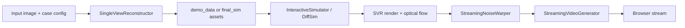

# RealWonder Repo Progress And Architecture

Date: 2026-03-30

## 1. Executive Summary

This repository is not a bare video diffusion model. It is already a fairly complete interactive system that connects:

1. single-image 3D reconstruction
2. physics simulation
3. simulation-to-video condition conversion
4. a distilled causal video generator
5. a web demo with streaming and timing instrumentation

My current judgment is:

- The core research prototype is complete enough to reproduce the paper path.
- The real-time demo path is implemented and already contains several non-trivial systems optimizations.
- The codebase is now at the stage where the next meaningful gains will come from targeted speed research, not from basic plumbing.
- "Real-time" in the current repo mainly refers to the interactive demo after one-time preprocessing and warmup, not full online single-image reconstruction in the loop.

## 2. What Is Already Implemented

### 2.1 Functional status

| Capability | Status | Evidence |
| --- | --- | --- |
| Offline single-image scene preprocessing | Implemented | `demo_web/preprocess.py`, `simulation/image23D/single_view_reconstructor.py` |
| Offline simulation-to-video path | Implemented | `case_simulation.py`, `infer_sim.py` |
| Interactive web demo | Implemented | `demo_web/app.py`, `demo_web/simulation_engine.py`, `demo_web/video_generator.py` |
| Streaming block-wise generation | Implemented | `demo_web/app.py`, `demo_web/video_generator.py` |
| Structured timing logging | Implemented | `docs/DEMO_TIMING_LOGS.md`, `demo_web/experiment_logging.py`, `scripts/plot_interactive_demo_timing.py` |
| Kernel warmup and cache-aware startup optimization | Implemented | `_warmup_pipeline()` in `demo_web/app.py` |
| Public paper/research packaging | Implemented | `README.md` |

### 2.2 Current maturity assessment

| Layer | Maturity | Notes |
| --- | --- | --- |
| Research idea | High | Repo matches the paper framing closely. |
| Demo engineering | Medium-High | The streaming demo is thoughtfully engineered, not a toy wrapper. |
| Benchmark automation | Medium | Logging and plotting exist, but no committed timing runs are included in repo. |
| Speed optimization depth | Medium | Several strong optimizations already exist, but there is still obvious headroom. |
| Generalization of interaction interface | Medium-Low | Forces and actions are still largely case-handler driven, not a unified action/world interface. |
| End-to-end online reconstruction + interaction | Low | Demo uses precomputed `demo_data/*`, so online preprocessing is not yet part of the real-time loop. |

## 3. Codebase Structure

### 3.1 High-level directories

| Path | Role |
| --- | --- |
| `demo_web/` | interactive server, streaming pipeline, UI-specific wrappers |
| `simulation/` | reconstruction, Genesis simulation, case-specific physics logic |
| `vidgen/` | causal video generation pipeline and wrappers |
| `wan/` | Wan model backbone and utilities |
| `cases/` | raw case assets and configs |
| `demo_web/demo_data/` | precomputed assets for demo-time real-time interaction |
| `submodules/` | external heavy dependencies: `sam2`, `sam_3d_objects`, `Genesis`, `flux_controlnet_inpainting` |
| `docs/` | setup, runbook, timing docs |

### 3.2 Pipeline graph

### 3.3 Important entry files

| File | Purpose |
| --- | --- |
| `README.md` | paper-level overview and install/run instructions |
| `demo_web/app.py` | main streaming orchestration, warmup, timing, socket server |
| `demo_web/simulation_engine.py` | interactive Genesis wrapper and lightweight point renderer |
| `demo_web/video_generator.py` | block-wise causal SDEdit generation and decoding |
| `vidgen/pipeline_sdedit.py` | causal video diffusion with SDEdit support |
| `vidgen/models.py` | Wan wrappers, cached VAE encode/decode, encoders |
| `demo_web/preprocess.py` | one-time preprocessing for demo assets |
| `case_simulation.py` | offline physics simulation and noise warping |
| `infer_sim.py` | offline video generation from simulation outputs |

## 4. Real Dataflow

## 4.1 Precompute path

The repo has two distinct phases:

1. precompute scene assets from a single image
2. reuse those assets during interactive generation

The precompute step runs:

- segmentation via SAM2 or RepViT
- background inpainting via Flux-based inpainting
- single-object 3D reconstruction via `sam_3d_objects`
- background depth estimation via MoGe
- saving meshes, point clouds, masks, camera, and config into `demo_web/demo_data/*`

This is why the demo can be interactive afterward.

## 4.2 Interactive path

At interactive time, the main loop is:

1. Genesis advances physics for a few internal steps.
2. The current state is rendered into simulation RGB plus optical flow.
3. Noise is warped incrementally using the flow.
4. Simulation frames are VAE-encoded into latent space.
5. A 4-step causal SDEdit-style video model generates the final block.
6. Frames are streamed to the browser asynchronously.

This is implemented explicitly as a pipeline in `demo_web/app.py`:

- Stage 1a: physics producer
- Stage 1b: render + flow producer
- Stage 2: noise warp
- Stage 3: VAE encode + diffusion
- Stage 4: frame streaming

## 5. Current Speed-Oriented Design Choices Already Present

The repo already contains many of the ideas that later papers treat as contributions.

### 5.1 Streaming and block-wise generation

- `FRAMES_PER_BLOCK = 3` latent frames
- causal block generation instead of full-sequence bidirectional denoising
- block overlap between simulation, warp, diffusion, and browser streaming

This is the strongest sign that the repo is already in the "systems-optimized research prototype" stage.

### 5.2 Few-step generation

The paper and README state a distilled video generator requiring only 4 denoising steps. This is already a major acceleration strategy compared with conventional video diffusion sampling.

### 5.3 KV cache and cross-attention cache reuse

`vidgen/pipeline.py` and `vidgen/pipeline_sdedit.py` allocate and reuse:

- self-attention KV cache
- cross-attention cache

This is essential for causal streaming and is conceptually close to later streaming video papers.

### 5.4 Cached VAE encode/decode

`WanVAEWrapper` already exposes:

- `cached_encode_to_latent`
- `decode_to_pixel(..., use_cache=True)`

The demo uses a separate `encode_vae` instance to avoid cache conflicts and reduce pipeline interference.

### 5.5 Prompt and first-frame precomputation

`StreamingVideoGenerator.precompute_first_frame()` precomputes prompt-independent conditioning. `prepare_generation()` only does lightweight per-request work.

### 5.6 Warmup for kernel compilation and cold-start removal

`_warmup_pipeline()` in `demo_web/app.py` is very informative:

- it states that without warmup, first generation can pay about 24 seconds of one-time kernel compilation
- it explicitly warms simulation, warping, VAE encode, diffusion, and the non-empty KV-cache path
- comments indicate cold block-0 and block-1 diffusion can be about 4 seconds each before warmup and about 1 second after warmup

That means the current team has already diagnosed and removed first-request latency, not just steady-state latency.

### 5.7 Optional faster decoder

`demo_web/video_generator.py` supports `--taehv`, indicating the repo already has an optional speed-quality tradeoff for decoding.

## 6. Where The Current Bottlenecks Likely Are

Important: there are no committed timing run outputs under `demo_web/demo_data/*/experiment_logs/` in the current repo snapshot, so the following is an inference from code and comments, not a measured statement from stored logs.

### 6.1 Likely steady-state bottleneck

Most likely steady-state bottleneck:

- Stage 3 diffusion

Why:

- it contains VAE encode, mask processing, and the causal Wan denoiser
- it is the only stage that intentionally consolidates heavy GPU work
- Stage 1 and Stage 2 are already split into separate producers to hide latency under Stage 3

### 6.2 Secondary bottleneck

Likely second bottleneck:

- simulation render + optical flow

Why:

- `render_and_flow()` still performs point rendering and optical-flow computation per frame
- particle materials require mapping particle motion back to foreground points
- the renderer is lightweight relative to the diffusion model, but it is still in the critical path

### 6.3 What is probably not the main bottleneck

Likely not dominant in steady state:

- text encoding, because it is precomputed or cached aggressively
- browser streaming, because it runs in a separate thread
- background rendering, because background is cached

## 7. Project Progress By Module

### 7.1 Reconstruction

Status: working, but not in interactive loop.

Evidence:

- `demo_web/preprocess.py` creates all assets needed by the demo
- interactive demo loads `demo_data/*` instead of reconstructing online

Interpretation:

- reconstruction is a solved preprocessing stage for the current prototype
- if the goal becomes "instant scene upload and interact," this stage will need major acceleration

### 7.2 Physics

Status: working and general enough across rigid, cloth, liquid, sand, elastic materials.

Evidence:

- `simulation/genesis_simulator.py`
- `demo_web/simulation_engine.py`
- per-case configs for rigid, PBD, and MPM materials

Interpretation:

- physics support breadth is already strong
- but control is still case-template driven, not yet a unified learned action interface

### 7.3 Video generator

Status: strong and already optimized.

Evidence:

- causal inference pipeline
- SDEdit with simulation latent
- KV cache reuse
- cached VAE
- few-step denoising
- optional fast decoder

Interpretation:

- this is the best place to apply recent fast causal video generation literature

### 7.4 Evaluation and benchmarking

Status: partially done.

Evidence:

- timing logger exists
- plotting tool exists
- runbook exists
- no checked-in benchmark results exist

Interpretation:

- infra is ready
- the missing piece is systematic profiling runs and model-to-model comparisons

## 8. What The Repo Is Missing If The Goal Is "Next Speed Frontier"

### 8.1 No unified benchmark report in repo

There is no checked-in summary answering:

- average per-block Stage 1 vs Stage 2 vs Stage 3 time
- case-wise FPS
- TAEHV on/off delta
- latency sensitivity to `frame_steps`, `num_output_frames`, or denoising schedule

### 8.2 No quantized inference path

I did not find an integrated INT8/FP8 inference path for the Wan generator or decoder.

### 8.3 No learned simulator replacement

The system still depends on Genesis during interactive generation. For some rigid or low-complexity cases, a learned dynamics head could be faster than full simulation.

### 8.4 No long-horizon memory module beyond local attention plus caches

Current memory is strong but still mostly:

- causal local attention
- KV cache
- block-wise context accumulation

I do not see a dedicated reconstituted long-horizon memory mechanism like recent world-model papers.

### 8.5 No online reconstruction in the loop

This matters because some recent fast world-model papers improve the total user experience by accelerating representation construction, not only per-frame generation.

## 9. Best Interpretation Of Current Project Stage

The repo is beyond "can we make it work?" and already at:

"Can we push a real-time, physics-conditioned, block-causal video system to the next latency regime without losing controllability?"

That means the most valuable next steps are:

1. targeted model-side speedups for Stage 3
2. memory design for longer and more stable streaming
3. selective replacement of expensive physical/rendering components
4. better action interfaces that preserve physical grounding without always paying full simulator cost

## 10. Immediate Recommendations Before New Research Changes

These are the experiments I would run first before any major retraining:

1. collect timing logs for all four demo cases with and without `--taehv`
2. aggregate per-stage averages, p50, p90, and overlap ratio
3. verify whether Stage 3 dominates in all cases or only in rigid-heavy cases
4. profile the cost split inside Stage 3: `VAE encode` vs `diffusion`
5. profile the cost split inside Stage 1: `physics step` vs `render+flow`

If Stage 3 dominates, literature effort should focus on:

- fewer denoising steps
- stronger streaming memory
- decoder acceleration

If Stage 1 dominates, literature effort should focus on:

- cheaper physical proxies
- cheaper scene representation
- better render-to-condition abstraction

## 11. Bottom Line

RealWonder already contains the right high-level structure for interactive video generation:

- explicit world state
- physically grounded action bridge
- simulation-derived conditioning
- few-step causal video rendering
- streaming orchestration

The next leap is unlikely to come from one isolated micro-optimization. It will come from combining:

1. stronger causal streaming model design
2. more aggressive few-step distillation
3. smarter long-horizon memory
4. selective replacement of expensive simulator/rendering components with learned or lighter proxies

